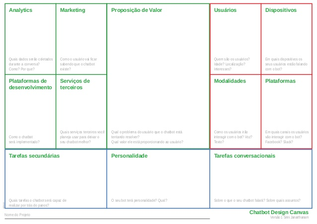

# Planejamento

## Planejamento é a base de tudo!

Como desenvolvedores apaixonados por código, somos tentados a buscar num primeio momento quais linguagens e frameworks nos permitem criar chatbots. No entanto quando vamos criar um chatbot com produto devemos fazer o planejamento.

X% dos pprojetos fracassam por não terem um planejamento de recursos necessários e não estarem alinhados com os objetviso estratégicos do negócio no qual ele está inserido.

Um exmeplo básico disso qé um chabot que se propõe a tirar dúvidas sobre um determinado assunto e não consegue responder as perguntas báscias .

